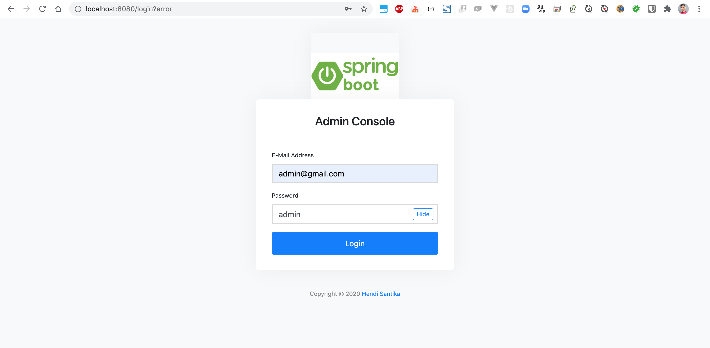
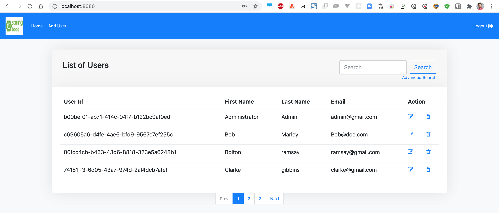
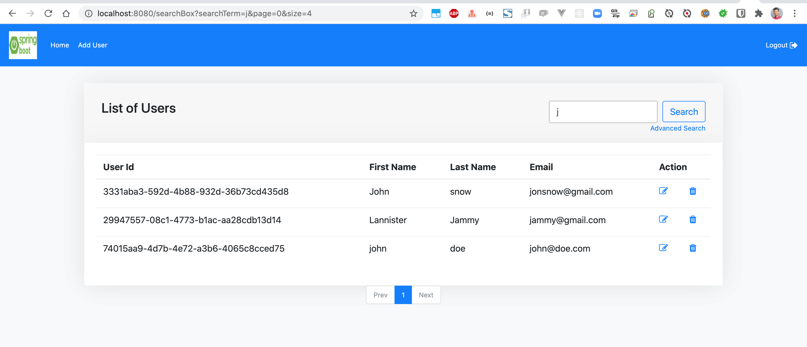
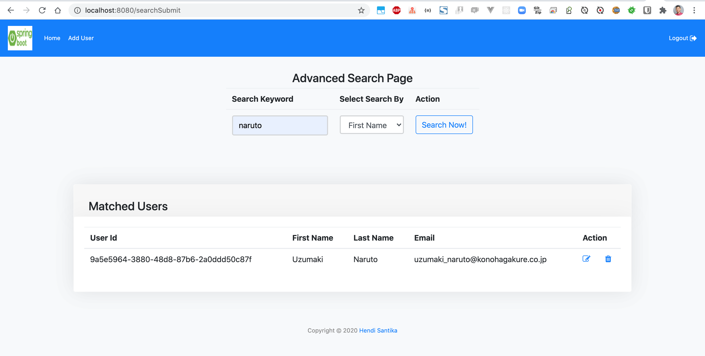
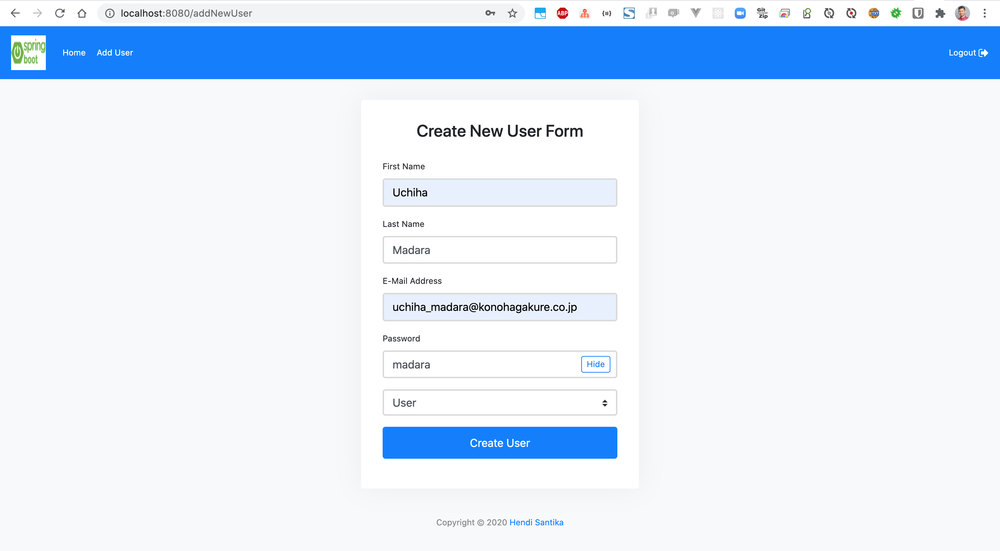

# user-management-app
This Standalone Spring Boot Project is a User Management Systen for admins to perform operations on users.

## 1. Used Database - H2

## 2. Running as a Packaged Application (Following ways)
    Way-1 : java -jar target/user-management-app-0.0.1.war

    Way-2 : mvn clean spring-boot:run (using maven)

## 3. Pass explicit value from command line while you go for run this app.
for example, want to run app on 9090 port number instead of default(8080)

    Way-1 :- java -jar target/user-management-app-0.0.1.war --server.port=9090

    Way-2 :- mvn clean spring-boot:run -Drun.arguments="--server.port=9090,--spring.profiles.active=dev"

## 4. DB configuration are provided in /user.management.system/src/main/resources/application.properties file.
    4.1. you can change it's value as per your convenient. as per explained in step-3.

    4.1.1 for example, I want to change my db-user name, then I can do something likewise while I go for start my app,
 mvn clean spring-boot:run -Drun.arguments="--spring.datasource.username=newUserName"
 
 
## 5. To generate .war file we need to clean install our project by following command(Maven should be installed),
    Way-1 - mvn clean install

    Way-2 - if have eclipse(IDE) then following steps is enough to have packaged app file, (right click on project) -> Run -> Maven install which will generate 1-war file namely "user.management.system-0.0.1-SNAPSHOT.war" under 'target' directory

## 6. Once the application is started you can access http://localhost:8080/
    username: admin@gmail.com
    password: admin

## Image Screen shot:

Login Page:

Home Page:
    

Search Page:

Advanced Search Page:    

Create User Page:

## Future Project Enhancement notes,

    Login/Logout functionality
        1.1 Forgot password
    
        1.2 reset password / change password
    
        1.3 security question while go for change/reset password
    
            1.3.1. email through user confirmation
            1.3.2 OTP through user confirmation
        
        1.4 user-profile management
            1.4.1 profile pic
            1.4.2 more details of users like, address1, addres2, pincode, mobile number...etc.
        1.5 search functionality with auto-completion feature
        1.6 Modern UI

